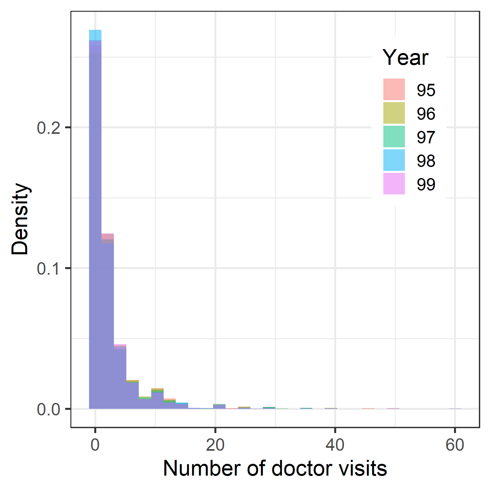
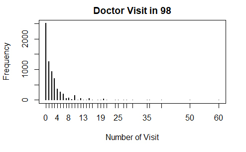
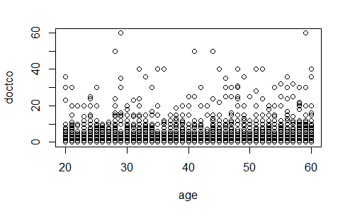

```{r message=FALSE, echo = FALSE}
library(tidyverse)
library(dplyr)
library(ggplot2)
library(foreign)
library(pglm)
library(MASS)
library(PLNmodels)
library(pscl)
library(knitr)
library(kableExtra)
library(gridExtra)
library(quantreg)
library(corrplot)

knitr::opts_chunk$set(echo = TRUE)
knitr::opts_chunk$set(fig.pos = "!H", out.extra = "")
```

# Summary

Our final project based on the paper which evaluates the German health care reform of 1997 (Winkelmann 2004). The individual number of doctor visits is the outcome measure. The data set is from German Socio-Economic Panel for the years 1995-1999, 32837 observations are collected.

As the final project for STAT 520 Applied Econometrics, we decided to reproduce the work in table 1, 2, 3 and part of table 5 as the pedagogical exercises. We will implement five different models including (1) Poisson regression model, (2) negative binomial regression model, (3) Zero-inflated negative binomial regression model, (4) Hurdle negative binomial model, and (5) Hurdle probit poisson log normal model, and evaluate them by log-likelihood, Akaike (AIC) and Bayesian (BIC) Information Criterion. Among all the models, Hurdle negative binomial model demonstrates the best fitness to the data set. Based on the analysis, we found out that the 1997 reform is effective and it affected different groups differently. Our conclusions are consistent with the authors of the original paper.

Besides following the analysis in the original paper, we also generate some visualization to describe the data distributions and demonstrate the fitness of the models. The topics we learned in STAT 520 (Ordinary least square, Heteroscedasticity, Two-stage least squares) give us a solid foundation to understand the advanced topics and models such as Generalized linear models, Zero-inflated models, and Hurdle models in the paper.

# Introduction and Economic Problem of Interst

As one of the Organization for Economic Co-operation and Development (OECD) countries, Germany has a large publicly funded health sector taking a substantial portion of total GDP. A possible explanation for the increase in healthcare spending includes (1) expanding technological and expenditure possibilities in the healthcare services, (2) the surge in demand from the aging population, and incentive structures in the public health sector not promoting the efficient use of resources. One of the significant reforms on the German healthcare system was the reform of 1997, in which the co-payments for prescription drugs were raised by 200%, and the reimbursements of physicians by state insurance were capped. To evaluate the effect of the healthcare reform of 1997, we want to know (1) whether the reform of 1997 is successful and effective and (2) how the effect of reform differs among different groups of the population.  

Some background information needs to be elaborated on before we dig into the analysis. The general aim of this reform is to limit healthcare expenditure and its growth rate. The change in co-payments (for prescription) drugs is the most eminent element of the 1997 reform, with measures like an extended exclusion list of drugs not covered at all by social insurance, price ceilings related to the availability of generics, and a binding overall annual budget for drugs and doctor service. 

An increased co-payment has a direct fiscal effect of reducing the proportion of cost covered by the insurer. The increased out-of-pocket expenses would disincentive customers from excessive use of prescription drugs and medical resources as a moral hazard. 

The analysis of this paper focuses on the disincentivizing effect on prescription drug use by tracking the number of doctor visits by a person during a given time. In addition to  the unavailability of direct information on precription drug use, a rationale for this approach is that the demand for prescription drugs and the demand for doctor visits are closely related, if not complementary to each otehr. The implemented policy increased the out-of-pocket expenses for prescription drugs, and the patient might try to persuade the doctor to prescribe in larger size in an appointment or reduce their drug use -- in either case we can see a reduction in doctor visits. Though some other effects might affect the number of visits -- one might still see a doctor for diagnosis or advice on non-prescription drugs, the number of such visits would not be affected by the increased co-payment as a result of reform. Thus, an analysis of patient visits could help us get some insights into the effectiveness and success of the 1997 Healthcare reform.

In this report, we will first describe the dataset and how to organize them as the systematic components, introduce econometric models like Poisson Regression Model,Negative binomial Regression Model,Zero-Inflation Negative Bionomial, Hurdle Negative Binomial Model Regression Model, Two components Negative Binomial Model. After fitting the model to the dataset, we will analyze and discuss the results.

# Data

The GSOEP is an ongoing annual household survey and the author selected fives years of data centered around the year of the reform, i.e. 1995-1999. The primary empirical strategy is to pool the data over the five years and estimate the effects of the reforms by comparing the expected number of visits in 1998 and 1996 *ceteris paribus*, i.e., for an individual with given characteristics. 

The models that will be estimated in the following sections all include a systematic component (linear predictor) of the type

\begin{align*}
x'_{it}\beta 
=& \beta_0 + \beta_1 \mathrm{age}_{it} + \beta_{2} \mathrm{age}^2_{it} + \beta_3 \mathrm{years~of~education}_{it} + \beta_4 \mathrm{married}_{it} + \beta_5 \mathrm{household ~size}_{it}\\
+& \beta_6 \mathrm{active~sport}_{it} + \beta_7 \mathrm{good~health}_{it}+\beta_8\mathrm{bad~health}_{it}+\beta_9\text{self-employed}_{it}\\
+& \beta_{10}\text{full-time employed}_{it}+\beta_{11}\text{part-time employed}_{it}+\beta_{12}\mathrm{unemployed}\\
+& \beta_{13}\mathrm{equivalent~income}_{it}+\beta_{96}(\mathrm{year=1996})_{it}+\beta_{97}(\mathrm{year=1997})_{it}\\
+& \beta_{98}(\mathrm{year=1998})_{it}+\beta_{99}(\mathrm{year=1999})_{it}
\end{align*}

The reference year is 1995. In addition, there are three dummies for the quarter in which the
interview took place (winter, autumn, spring). 

There are three general channels through which these variables can affect the demand for doctor visits. The first is the underlying health status, the second the budget constraint, and the third the preference formation.

There is no direct health status in the GSOEP. We have the following three sets of proxies instead. Clearly, these are only crude measures of health, and one may want to account for the possibility of additional unobserved heterogeneity to capture any remaining health aspects, as well as other unobserved influences.

* A time-consistent measure of health over 1995–1999 is provided by a subjective self-assessment in response to the question: "How good do you perceive your own health at current?", with responses "very good", "good", "fair", "poor" and "very poor". The two best responses are classified as "good health", the two worst responses as "bad health", with fair health being the reference group. 
* Another reasonable proxy for health is the age polynomial. 
* Finally, engaging in "active sports" (defined as once a week or higher frequencies) acts as a further proxy for good health, although it might have an additional direct effect on the demand for health services as well. 

The budget constraint is determined by income and prices. The main price variables are the opportunity costs of a visit to a doctor which, in turn, depend on education level and employment status. 

Several of the variables affect more than one aspect at a time. Age, for instance, matters for health, opportunity cost (through the effect of experience on earnings) as well as potentially preferences. Similarly, education is an important factor in determining the optimal investment in health capital. While all those interactions are worth further investigations, it is not the goal of this paper to analyze these various transmission channels -- the focus lies on the year dummies, whereas the other variables serve as controls for their potential effects on the changes in visits over time.

# Explorative Analysis of Data
{width=100%}
{width=49%}
{width=49%}

{width=49%}
{width=49%}
{width=49%}
{width=49%}
{width=49%}
{width=49%}


{width=49%}
{width=49%}

{width=49%}
{width=49%}
{width=49%}
{width=49%}
{width=49%}
{width=49%}


From the histograms above, we can observe that there are a large amount of $0$ in the data, and overall the number of 0 increases from 1996 to 1998. Most notably, we can see a decrease in frequency for number of visits between 1 to 13. Such decrease was across groups with different socioeconomical conditions, and it was more apparent on those who were healthy (based on self-reported health conditions and sport active level)


# Econometric Models for consideration

Since the response variables, the number of the doctor visits, are count data, we first consider generalized linear model (GLM) with Poisson distribution. 

## Generalized linear model

Generalized linear model (GLM) allows the response variable $y$ to have an error distribution other than a normal distribution. It has three main components: (1) Systematic component (2) Link function (3) Probability distributions. We define $\{(y_i, \mathbf x_{i*})\}_{i=1}^n$ as following a generalized linear model based on the exponential family $f_\theta$ if 

\[
y_i \sim f_{\theta_i}, ~~~ \theta_i = \mathbf{x_{i*}^T} \mathbf{\beta}
\]

The exponential family is defined as 

\[
f_\theta(y) = \exp(\theta y - \psi(\theta)) h(y)
\]

Here $\theta$ is called the natural parameter, $\psi$ is called the log-partition function, and $h$ is called the base measure. The distribution with density $f_{\theta}$ is called a one-parameter natural exponential family.

###  Poisson Regression Model

We take the Poisson distribution as the standard probability distribution for count data
\[ 
P(y_i|\lambda_i)=\frac{\exp(-\lambda_i) \cdot \lambda_{i}^{y_{i}}}{y_{i}!} 
\] s.t
$\mathrm{E}\left(y_{i} \mid \lambda_{i}\right)=\operatorname{Var}\left(y_{i} \mid \lambda_{i}\right)=\lambda_{i}$

We assume heterogeneous population with covariance $x_i$ in regression, $\lambda_{i}=\exp (x_{i}^{T} \beta)$, $y = (y_1,...y_N)^{T}$, $x = (x_1,...x_N)^{T}$. The data was randomly sampled by

\[
P(y \mid x)=\exp \left[-\sum_{i=1}^{N} \exp \left(x_{i}^{\prime} \beta\right)\right] \prod_{i=1}^{N} \frac{\left[\exp \left(x_{i}^{\prime} \beta\right)\right]^{y_{i}}}{y_{i} !}
\], and we look for the maximum likelihood (MLE).

The relative change in expected doctor visits as reform effects can be calculated with 

\begin{align*}
\Delta \%_{(98,96)} 
=& 100 \times [\frac{\mathrm{E}(y_{i, 98} | x)}{\mathrm{E}(y_{i, 96} | x )}-1] \\
=& 100 \times [\exp (\beta_{98}-\beta_{96})-1]
\end{align*}


It should be noted that the Poisson Model has a few shortcomings:

1. The assumption exclude the case of unobserved heterogeneity

2. It ignore the Panel Structure of the data and the Standard Errors need to incorporate possible serial correlation (unless we can assume constant individual effect over time)

3. The single index structure of the Poisson Regression model implies that the distribution is determined w.r.t the given mean, and we cannot evaluate the effect of the reform over the distribution (i.e cannot how it affect different sections of the population)

#### The random effect and fixed effect models

In statistics, a random effects model, also called a variance components model, is a statistical model where the model parameters are random variables. It assumes that the data from a hierarchy of different populations whose differences relate to that hierarchy and the hetrogeneity is uncorrelated with the independent variables. Random effect models assist in controlling for unobserved heterogeneity when the heterogeneity is constant over time and not correlated with independent variables. This constant can be removed from longitudinal data through differencing, since taking a first difference will remove any time invariant components of the model. (Wooldridge 2011)

On the other side, a fixed effects model is a statistical model in which the model parameters are fixed or non-random quantities. It assumes that the individual-specific effects are correlated with the independent variables. It assists in controlling for omitted variable bias due to unobserved heterogeneity when this heterogeneity is constant over time. This heterogeneity can be removed from the data through differencing, for example by subtracting the group-level average over time, or by taking a first difference which will remove any time invariant components of the model.

### Negative binomial regression Model

To model the count data, we can also use Negative binomial regression. It is a generalization of Poisson regression. Negative binomial distribution can be considered as a generalization of Poisson distribution by including a gamma noise variable which has a mean of 1 and a scale parameter of $\nu$. The poisson-gamma mixture distribution that results is 

\[
\mathrm{Pr}(Y = y_i | \mu_i, \alpha) = \frac{\Gamma(y_i + \alpha^{-1})}{\Gamma(y_i +1)\Gamma(\alpha^{-1})} (\frac{\alpha^{-1}}{\alpha^{-1}})
\]

, where $\mu_i = t_i \mu$ and $\alpha = \frac{1}{\nu}$.

## Zero-inflated negative binomial model

Zero-inflated models have been developed to cope with zero-inflated outcome data with over-dispersion (negative binomial) or without (Poisson distribution). In this project, zero-inflated negative binomial regression is applied on the dataset.

A zero-inflated (ZI) model assumes that the zero observations have two different origins: "structural" and "sampling". The sampling zeros are due to the usual negative binomial distribution, which assumes that those zero observations happened by chance. Zero-inflated models assume that some zeros are observed due to some specific structure in the data (Hu et al 2011) 

Formally speaking, the zero-inflated density function is a mix of a point mass at zero and a count distribution.
$$f_{zi}(y ; x, z, \beta, \gamma)=f_{0}(0 ; z, \gamma) I_{\{0\}}(y)+\left(1-f_{0}(0 ; z, \gamma)\right) f_{\text {count }}(y ; x, \beta)$$ with $I(\cdot)$ as the indicator function, inflated probability of observing a zero as $\pi = f_0(0;z;\gamma)$,  unobserved probability $\pi$ of belonging to the point mass component modelled by a binomial GLM $\pi = g^{-1}(z^T\gamma)$ (Zeileis et al)

For the problem of the original paper, the number of the doctor visits is the outcome, some participants may visit zero in certain year because they do not need to and such decision was not affected by the reform. To this end, the number of doctor visit is assumed to be on a negative binomial distribution that includes both zero (the "sampling zeros") and non-zero counts. Consider the issues with excesssive zeros displayed in the graph above, Zero-inflated negative binomial model can be good candidate in this case.

## Hurdle Models

In contrast to ZI models, a hurdle model assumes that all zero data are from one "structural" source. The positive (i.e., non-zero) data have "sampling" origin, following either truncated Poisson or truncated negative-binomial distribution (Mullahy 1986). The hurdle model has been popular in the health literature, in part because it can be given a structural interpretation that seems to agree well with the intuition of a dual decision structure of the demand process.

For the study discussed in the original paper. It is  reasonable to assume that healthy people might have zero number of doctor visit and people who start to feel ill or have not finish the treatment will have non-zero number of doctor visits in a year. Hence, the zero observations can come from only one structural source -- the patients. If a subject is considered a patient, they would not have zero number of doctor visits in a whole year and would always have a positive number of visit in a hurdle model, with either truncated Poisson or truncated negative binomial distributions.

Define $d_i = 1$ if a person does not see a doctor in the period and $d_i = 0$ if he/she sees a doctor, s.t. $d_i = 1 - \mathrm{min}(1,y)$, the probability function of the hurdle model is 

\[
f\left(y_{i}\right)=f_{1 i}^{d_{i}}\left[\left(1-f_{1 i}\right) f_{T}\left(y_{i} \mid y_{i}>0\right)\right]^{1-d_{i}}
\], with $f_{1i} = P(d_i = 1)$, $f_T(y_i|y_i>0) =  \frac{f_2 (y_i)}{1-f_{2i}(0)}$.

For $f_1$, we have the following hurdle functions as candidates

1. Poisson: $\exp(-\exp(x_{i}^{T}\gamma))$
2. Negative Binomial, Type 1: $(1+\theta)^{-\exp(x_{i}^{T}\theta)/\theta}$
3. Negative Binomial, Type 2: $[\alpha/(\exp(x_{i}^{T}\alpha)+\alpha)^\alpha]$
4. Logit: $\frac{\exp(x_{i}^{T}\gamma)}{1+\exp(x_{i}^{T}\gamma)}$
5. Probit: $\Theta(x_{i}^{T}\gamma)$

For $f_2$, we have

1. Poisson
2. Negative Binomial
3. Poisson-log-normal $p(x) = (\exp(x\mu + x^2 \sigma/2) \cdot (2 \pi \sigma)^{-1/2})/x! \cdot g(y)$

## Generalized linear model

# Results

## Table 1

We first reproduce table 1 to generate the summary statistics for the variables of the analysis. 

* In general, the health level of people increased
  + Despite volatile averages, the proportion of people in active sports increased from 24.7% to 30.7%
  + The proportion of people reporting good health increased from 56.2% to 59.5%, while the proportion of people reporting poor health decreased from 13.8% to 12.7%%

* Such trends can be meaningful for further analysis for the following two reasons:
  + improvements in the perceived health might be able to explain part of the reduction in the number of doctor visits, and one should control for that in order to isolate the reform effect.
  + these improvements provide some evidence against the possibility that the reforms, while being successful in containing costs, worsened the general health status, illustrating the positive netcontribution to general welfare.

* The average number of doctor visits per quarter declined from 2.66 to 2.35 between 1996 and 1998.
* The decline of the number of doctor visit between 1995 and 1996 is 1%. The increase between 1998 and 1999 is 2%. Therefore, the large drop (7.8%) between 1997 and 1998 in the number of visits clearly coincides with the timing of the reform.
* The increase of the number of doctor visit between 1998 and 1999 also supports the behavior hypothesis. It is because that the 1997 reform enjoyed only a short lifespan. The partial repeal of the 1997 reform was one of the first items on the political agenda of the new government selected in 1998, and a new law lowered the co-payments by between DM 1 and DM 3, effective January 1, 1999.
* The proportion of people reporting good health from 56 to 60% while the proportion reporting bad health decrease from 14 to 13%. This can be the partial reason supporting the idea that the 1997 reform did not worsen the general health status.


```{r message=FALSE, echo = FALSE}
kable(read.csv("out/table-1.csv", row.names=1, check.names=FALSE), 
      digits = 3, booktabs = T) %>%
  kable_styling(position = "center") %>%
  kable_styling(latex_options = "HOLD_position")
```


## Table 2

To fit and describe the number of doctor visit as the count data, we first applied Poisson regression while considering the random and fixed effects. The log-likelihood of the models are as follows.

* The pooled model: -86566.18.
* The random effect model: -70176.72.
* The fixed effect model: -42738.86.

The estimates of coefficients and standard errors for the basic Poisson model, with and without individual specific effects, are displayed in Table II. 

```{r message=FALSE, echo = FALSE}
opts <- options(knitr.kable.NA = "")
kable(read.csv("out/table-2.csv", row.names=1, check.names=FALSE), 
      digits = 5, booktabs = T) %>% 
  column_spec(2:8, width = "2cm") %>%
  kable_styling(position = "center") %>%
  kable_styling(latex_options = "HOLD_position")
```

We can make the following observations from Table II

* Men have less doctor visits than women.
* The expected number of doctor visits is u-shaped in age because \verb|age| is negative.
* The health indicators (\verb|Good health| and \verb|Bad health|) have the largest effect among all variables.
* There is a statistically significant decline in the expected number of doctor visits between 1996 and 1998 in all three model specifications.

## Table 3

Four additional models were applied on the same data set. Likelihood ratio tests clearly reject the Poisson model against the alternative models with unobserved heterogeneity.  AIC is used to pick the best model among all five models. We also calculated BIC as the alternative criteria and it supported the same conclusion as AIC. Zero-inflated negative binomial and hurdle negative binomial models are the best two models. 

```{r message=FALSE, echo = FALSE}
kable(read.csv("out/table-3.csv", check.names=FALSE), booktabs = T) %>%
  kable_styling(position = "center") %>%
  kable_styling(latex_options = "HOLD_position")
```

## Table 5

The relative changes in expected doctor visits from 1996 to 1998 for each models are as follows. The basic models (Poisson and Negative Binomial models) estimate the reform effect as -10% and -8%. However the structural models (Zero-inflated negative binomial and Hurdle negative binomial models) estimate the reform effect as -6% and -3%. The differences between the two kinds of models support the idea that the survey, which was conducted in the hospital, was over-represented by patients with more doctor visits. 

```{r message=FALSE, echo = FALSE}
table5_df <- tibble(Models=c("Poisson", "Negative Binomial", 
                    "Zero-inflated Negative Binomial", 
                    "Hurdle Negative Binomial Model"),
           "Delta % (96, 98)"=c("-10.060%", "-8.890%", "-6.321%", "-3.482%"))


                    # "Hurdle Probit Poisson Log Normal Model"

kable(table5_df, booktabs = T) %>%
  kable_styling(position = "center") %>%
  kable_styling(latex_options = "HOLD_position")
```
We also tried to reproduce the finite mixture model analysis. However, the original paper did not provide clear description about how the author divide the population. Here we developed our own strategy for separation and got the same conclusion as the author. We rank all the ids based on the sum of the number of doctor visits in survey from 1995 to 1999. Two-thirds of the population is the low-user group with a mean number of quarterly visits of 0.997, and the one-third belongs to a high-user group with a mean number of 4.839 visits per quarter. The reform effect of the two groups are as follows.

* Lower-user group ($p=0.663$, $\mu=0.997$): -8.573883
* Higher-user group ($p=0.337$, $\mu=4.839$): -6.185429

# Discussion

As another expansion and alternative to the Hurdle models in the original paper, we applied a zero-inflated negative binomial model (ZINB) on the data. Based on Table 3, ZINB outperformed basic models (Poisson and Negative binomial models) but fitted slightly worse than Hurdle Negative binomial model. It supports the idea that Hurdle assumption aligns better to the data. In other words, we tends to believe that all zero data are from one "structural" source. 

Overall, from Table 5, we can conclude that the reform of 1997 is effective in terms of reducing number of doctor visit. Evaluating the results from Zero-Inflation Negative Binomial vs. Negative Bionomial and the result from two-component negative binomial, we can observe that there are effect are unevenly distributed -- the left-margin/less frequent users have stronger response to the reform. A possible explnation of this uneven effects is that the higher-users/more frequent users has a consistent and stronger demand for doctor visits, given their potentially unfavorable health status.

The index models used in this research can be applied to study the effect of other medical healthcare events. From 1990 - 2015, multiple attempts were made to improve the solidarity-based system through competition to further improve economic efficiency of the healthcare system and promote technological advancement. (Busse et al 2017) If policy objective is on the effect of promoting efficient and responsible use of healthcare services, we might apply the same analysis to the Act to Strengthen Competition in Statutory Health Insurance in 2007 and the Statutory Health Insurance Care Structures Act, given that the primary policies of 2007 reform are

* mandatory universal coverage
* introduction of a uniform contribution rate, a central reallocation pool  and resource allocation to sickness funds according to a morbidity-based risk structure compensation scheme
* choice of tariffs in statutory health insurance

The 2011 Acts are more focused on supplementary premiums and reimbursement for new pharmaceutical products. It should be noted that to evaluate the effect of both reforms, in addition to variables we used in previous analysis, we might want to incorporate more economic variables related to economic growth, business cycles, considering the 2008 recession and 2010s European Sovereign Debt Crisis.

\pagebreak

# Bibliography
Busse, Reinhard, Miriam Blümel, Franz Knieps, and Till Bärnighausen. “Statutory Health Insurance in Germany: A Health System Shaped by 135 Years of Solidarity, Self-Governance, and Competition.” _The Lancet_ 390, no. 10097 (2017): 882–97. https://doi.org/10.1016/s0140-6736(17)31280-1. <br/>

Hu, Mei-Chen, Martina Pavlicova, and Edward V. Nunes. “Zero-Inflated and Hurdle Models of Count Data with Extra Zeros: Examples from an HIV-Risk Reduction Intervention Trial.” _The American Journal of Drug and Alcohol Abuse_ 37, no. 5 (2011): 367–75. https://doi.org/10.3109/00952990.2011.597280. <br/>

Mullahy, John. “Specification and Testing of Some Modified Count Data Models.” _Journal of Econometrics_ 33, no. 3 (1986): 341–65. https://doi.org/10.1016/0304-4076(86)90002-3. <br/>

Winkelmann, Rainer. “Health Care Reform and the Number of Doctor Visits—an Econometric Analysis.” _Journal of Applied Econometrics_ 19, no. 4 (2004): 455–72.<br/> https://doi.org/10.1002/jae.764. 

Wooldridge, Jeffrey M. _Econometric Analysis of Cross Section and Panel Data_. 2nd ed. Cambridge, MA: MIT, 2011. <br/>

Zeileis, Achim, Christian Kleiber, and Simon Jackman. “Regression Models for Count Data in R .” Accessed January 10, 2022. https://cran.r-project.org/web/packages/pscl/vignettes/countreg.pdf. <br/>


\pagebreak

# Appendix

## The calculation of table 1
```{r, child="rmd/table-1.Rmd", eval = TRUE}
```
## The calculation of table 2
```{r, child="rmd/table-2.Rmd", eval = TRUE}
```
## The calculation of table 3
```{r, child="rmd/table-3.Rmd", eval = TRUE}
```
## The calculation of table 5
```{r, child="rmd/table-5.Rmd", eval = TRUE}
```
## Box, violin, and histogram plots
```{r, child="rmd/distribution-plots.Rmd", eval = TRUE}
```